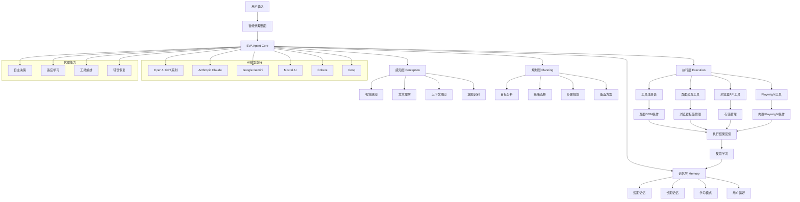

# EVA - Intelligent Browser Agent Extension

<div align="center">
  
</div>

<p align="center">
  <strong>EVA 是一个基于智能代理的浏览器扩展，具备感知、理解、规划和执行能力，能够通过自然语言理解用户意图，自动完成复杂的浏览器交互任务。它集成了 Playwright 浏览器自动化和多种 AI 模型支持，是一个功能强大且易于使用的智能浏览器助手。</strong>
</p>

## ✨ 核心特性

### 🤖 基于 Vercel AI SDK 的智能代理系统
- **多模型支持**: OpenAI GPT、Anthropic Claude、Google Gemini、Mistral、Cohere、Groq 等
- **ai-sdk 架构**: 采用 Vercel AI SDK 的 agent 设计模式
- **即用配置**: 直接输入 API Key 即可使用，展示可用模型列表
- **模型能力识别**: 自动识别视觉、代码生成、函数调用等模型能力

### 🎭 内置 Playwright 浏览器自动化
- **无需外部服务**: Playwright 直接打包到扩展中，安装即可使用
- **完整浏览器控制**: 点击、输入、滚动、截图、导航等操作
- **智能元素定位**: 支持多种选择器和智能元素识别
- **实时执行反馈**: 可视化操作过程和结果展示

### 🧠 智能感知与规划
- **多模态感知**: 视觉、文本、上下文综合理解
- **智能任务分解**: 将复杂请求自动分解为可执行步骤
- **自主决策**: 基于目标和环境进行智能规划
- **错误恢复**: 智能错误处理和备选方案

### 💬 双模式交互
- **智能代理模式**: 具备感知、规划、学习和执行能力的完整代理系统
- **聊天模式**: 传统的AI对话交互
- 无缝模式切换，满足不同使用场景

### 🧠 记忆与学习
- **短期记忆**: 当前会话的上下文和操作历史
- **长期记忆**: 用户偏好和学习模式存储
- **模式识别**: 自动识别和优化操作模式
- **个性化适应**: 根据用户习惯调整行为策略

### 🌐 多语言支持
- 支持中文和英文界面
- 可扩展的国际化框架

## 🚀 快速开始

### 📋 系统要求
- Chrome/Edge 浏览器 (版本 88+)
- 任一AI服务提供商的 API 密钥
- 无需额外安装 Node.js 或其他依赖

### ⚡ 一键安装

1. **克隆项目**
```bash
git clone https://github.com/your-username/EVA.git
cd EVA
```

2. **安装依赖**
```bash
npm install
```

3. **构建扩展**
```bash
npm run build
```

4. **加载到浏览器**
   - 打开 Chrome 扩展管理页面 (`chrome://extensions/`)
   - 启用"开发者模式"
   - 点击"加载已解压的扩展程序"
   - 选择 `.output/chrome-mv3` 目录

5. **配置 AI 模型**
   - 打开扩展设置页面
   - 选择 AI 提供商（OpenAI、Anthropic、Google、Mistral 等）
   - 输入 API 密钥
   - 选择具体模型（系统会自动显示可用模型列表）
   - 点击测试连接验证配置

### 🎮 立即体验

安装完成后，点击浏览器工具栏中的 EVA 图标，即可开始使用！

## 📐 系统架构

### 🛠️ 核心技术栈
- **框架**: [WXT](https://wxt.dev/) + React + TypeScript
- **AI服务**: Vercel AI SDK + 多模型提供商支持
- **浏览器自动化**: 内置 Playwright (无需外部服务)
- **UI组件**: Radix UI + Tailwind CSS
- **构建工具**: Vite
- **架构模式**: ai-sdk agent 设计模式

### 🏗️ 架构设计



## 🎯 使用指南

### 🔄 模式选择
EVA 提供两种模式：
- **智能代理模式**: 具备感知、规划、学习和执行能力的完整代理系统
- **聊天模式**: 传统的AI对话交互

### 🤖 智能代理示例

#### 基础交互
```
帮我点击"登录"按钮
```

#### 智能感知
```
分析一下这个页面的主要内容，告诉我有哪些可操作的元素
```

#### 复杂任务规划
```
我需要在电商网站上购买一个手机，帮我搜索、选择、加入购物车并结算
```

#### 自适应学习
```
上次我是如何在网站上找到下载链接的？请用同样的方式帮我
```

#### 上下文理解
```
这个页面看起来很复杂，能帮我找到注册入口吗？我想用我的邮箱注册
```

#### 多步骤工作流
```
帮我在社交媒体上发布一条动态：先登录，然后点击发布按钮，输入"今天天气真好"，最后发布
```

### 💬 聊天模式示例

#### 信息查询
```
请解释一下什么是机器学习
```

#### 内容创作
```
帮我写一封感谢邮件给我的导师
```

#### 技术支持
```
我的浏览器无法加载图片，可能是什么原因？
```

## 🔧 高级功能

### 🎭 内置 Playwright 浏览器自动化

EVA 已内置 Playwright，无需外部服务即可执行强大的浏览器自动化：

#### 基础页面操作
```
帮我点击"登录"按钮
在搜索框中输入"人工智能"并搜索
向下滚动页面查看更多内容
```

#### 页面导航和截图
```
打开 https://example.com 网站，然后截取整个页面的截图
```

#### 高级交互操作
```
将鼠标悬停在"产品"菜单上，然后点击"解决方案"子菜单
右键点击下载按钮并选择"另存为"
```

#### 多步骤复杂流程
```
打开电商网站，搜索"笔记本电脑"，选择第一个结果，添加到购物车，然后进入结算页面
```

#### 智能内容提取
```
分析这个页面的所有链接和图片，提取有用的信息
获取当前页面的表单数据
```

## ⚙️ 配置选项

### 🤖 AI模型配置
- **多提供商支持**: OpenAI、Anthropic、Google、Mistral、Cohere、Groq
- **即用配置**: 直接输入 API Key，系统自动显示可用模型
- **模型能力显示**: 自动识别并显示模型支持的能力（视觉、代码生成、函数调用等）
- **多配置管理**: 支持保存多个AI配置，方便切换
- **连接测试**: 一键测试API连接和模型可用性

### 🎨 界面设置
- **主题**: 浅色/深色主题切换
- **语言**: 中文/英文界面切换
- **模式选择**: 智能代理模式 / 聊天模式切换

### 🔧 浏览器自动化设置
- **智能元素定位**: 支持多种选择器策略
- **操作超时**: 可配置的等待时间
- **执行反馈**: 可视化操作过程和结果

## 🛡️ 安全和权限

### 🔐 权限说明
- `activeTab`: 访问当前活动标签页
- `scripting`: 注入内容脚本到页面
- `storage`: 保存用户配置和聊天历史
- `history`: 访问浏览器历史（可选功能）
- `tabs`: 获取标签页信息

### 🛡️ 安全措施
- 操作前可视化预览
- 敏感操作确认机制
- 严格的域名权限控制
- 操作日志记录

## 🚧 开发路线图

### ✅ 已实现功能
- [x] 基于 Vercel AI SDK 的智能代理核心架构
- [x] 多AI模型提供商支持（OpenAI、Anthropic、Google、Mistral、Cohere、Groq）
- [x] ai-sdk agent 设计模式
- [x] 即用型AI配置（直接输入API Key即可使用）
- [x] 内置 Playwright 浏览器自动化（无需外部服务）
- [x] 多模态感知系统（视觉、文本、上下文）
- [x] 智能任务规划和策略选择
- [x] 工具编排和执行引擎
- [x] 分层记忆和学习系统
- [x] 自适应决策能力
- [x] 双模式用户界面（Agent/Chat）
- [x] 实时状态监控和反馈
- [x] 页面元素操作（点击、输入、滚动、截图、导航）
- [x] 智能任务分解和执行
- [x] 可视化操作反馈
- [x] 多语言支持
- [x] 错误恢复和备选方案
- [x] 模型能力自动识别
- [x] 多配置管理

### 🚧 开发中功能
- [ ] 高级条件判断和循环逻辑
- [ ] 操作录制和智能回放
- [ ] 批量操作和宏功能
- [ ] 多标签页协调操作
- [ ] 云端同步和备份
- [ ] 性能监控和优化

### 📋 计划中功能
- [ ] 自定义操作模板和工作流
- [ ] 团队协作和任务共享
- [ ] 移动端浏览器支持
- [ ] 语音交互和命令
- [ ] 更多第三方服务集成
- [ ] 企业级安全功能
- [ ] API开放平台

## 🤝 贡献指南

欢迎为 EVA 项目做出贡献！

### 🛠️ 开发环境设置

1. **Fork 项目**
2. **创建特性分支**
```bash
git checkout -b feature/AmazingFeature
```

3. **提交更改**
```bash
git commit -m 'Add some AmazingFeature'
```

4. **推送到分支**
```bash
git push origin feature/AmazingFeature
```

5. **开启 Pull Request**

### 📝 代码规范
- 使用 TypeScript 进行类型安全开发
- 遵循 ESLint 和 Prettier 配置
- 编写单元测试
- 更新相关文档

## 📄 许可证

本项目采用 MIT 许可证 - 查看 [LICENSE](LICENSE) 文件了解详情

## 🙏 致谢

- [WXT](https://wxt.dev/) - 现代浏览器扩展开发框架
- [Vercel AI SDK](https://sdk.vercel.ai/) - AI集成工具包和 agent 设计模式
- [ai-sdk](https://sdk.vercel.ai/) - Vercel AI SDK 的核心包
- [Radix UI](https://www.radix-ui.com/) - 无障碍UI组件库
- [Tailwind CSS](https://tailwindcss.com/) - 实用优先的CSS框架
- [Playwright](https://playwright.dev/) - 现代浏览器自动化工具
- [TypeScript](https://www.typescriptlang.org/) - 类型安全的JavaScript
- [React](https://reactjs.org/) - 用户界面库
- [Vite](https://vitejs.dev/) - 现代前端构建工具

## 📞 联系我们

- 🐛 **问题反馈**: [GitHub Issues](https://github.com/your-username/EVA/issues)
- 💬 **功能建议**: [GitHub Discussions](https://github.com/your-username/EVA/discussions)
- 📧 **邮件联系**: eva@example.com

---

<div align="center">
  <p>如果这个项目对你有帮助，请给它一个 ⭐ Star！</p>
</div>